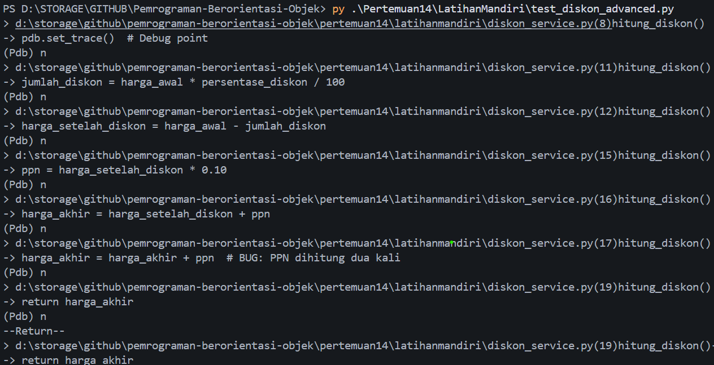

# Laporan Latihan Mandiri – Debugging OOP (DiskonCalculator)

## Pendahuluan
Dokumen ini merupakan hasil Latihan Mandiri (Laporan Pengujian) pada mata kuliah OOP.
Fokus latihan adalah debugging, dokumentasi bug, serta pengujian menggunakan `unittest`
pada studi kasus perhitungan diskon dan PPN.

---

## Deskripsi Program
Program terdiri dari sebuah class `DiskonCalculator` yang bertugas menghitung harga akhir
setelah diskon dan penambahan PPN 10%.

File utama:
- `diskon_service.py`
- `test_diskon_advanced.py`
- `DEBUG_REPORT.md`

---

## Penjelasan Kode diskon_service.py

### Class: DiskonCalculator
Class ini menerapkan konsep OOP, yaitu enkapsulasi logika perhitungan diskon
dalam sebuah method.

### Method: hitung_diskon(harga_awal, persentase_diskon)

Alur kerja method:
1. **Validasi Boundary**
   - Jika harga_awal <= 0 → return 0.0
   - Jika persentase_diskon < 0 → return harga_awal
   - Jika persentase_diskon > 100 → diset menjadi 100

2. **Perhitungan Diskon**
   ```python
   jumlah_diskon = harga_awal * persentase_diskon / 100
   harga_setelah_diskon = harga_awal - jumlah_diskon
   ```

3. **Perhitungan PPN 10%**
   ```python
   ppn = harga_setelah_diskon * 0.10
   harga_akhir = harga_setelah_diskon + ppn
   ```

4. **Simulasi Bug (Komentar)**
   ```python
   # harga_akhir = harga_akhir + ppn
   # BUG: PPN ditambahkan dua kali
   ```
   Baris ini tidak diaktifkan, hanya digunakan sebagai dokumentasi bug.

---

## Simulasi Bug PPN Ganda
Bug yang disimulasikan adalah **penambahan PPN 10% sebanyak dua kali**.
Bug ini menyebabkan harga akhir menjadi lebih besar dari seharusnya.

Bug tidak diaktifkan di kode final, namun dianalisis menggunakan:
- `pdb`
- inspeksi variabel `ppn` dan `harga_akhir`

---

## Laporan Pengujian

### Pengujian Dasar (`test_diskon.py`)
- Diskon 10% dari 1000 → 900
- Diskon 0% → harga tidak berubah
- Diskon 100% → harga 0
- Diskon negatif → harga tidak boleh turun

### Pengujian Lanjutan (test_diskon_advanced.py)
1. **Test Float**
   - Diskon 33% dari 999
   - Menggunakan `assertAlmostEqual`

2. **Edge Case**
   - Harga awal = 0
   - Hasil harus 0.0

Semua pengujian berhasil dijalankan tanpa error.

#### Screenshot Output Terminal

---

## Kesimpulan
1. Bug PPN ganda merupakan logic error, bukan kesalahan sintaks.
2. Bug berhasil diidentifikasi menggunakan `pdb` dengan memeriksa nilai variabel.
3. Perbaikan dilakukan dengan menghapus penambahan PPN yang berulang.
4. Unit testing terbukti efektif untuk mendeteksi kesalahan logika.
5. Program akhir berjalan sesuai spesifikasi dan lulus seluruh test case.
